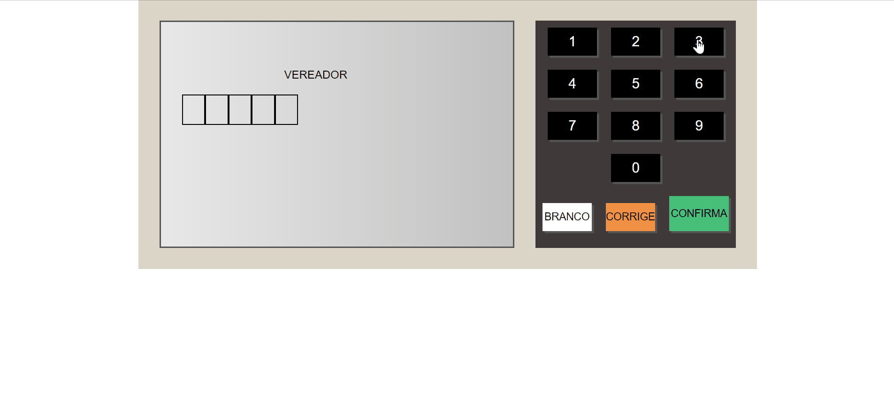

# Urna Eletrônica Online

<br>


[](https://urna-eletronica-online.netlify.app/)

<br>



<br>

## Descrição e AVISO!

<br>

> Projeto de uma urna eletrônica online, este projeto não é oficial e nem tenta se passar como tal, este projeto não foi autorizado pelo TSE, este projeto foi feito apenas para fins educativos, caso queira acessar o simulador oficial basta clicar [Aqui!](https://www.tse.jus.br/eleicoes/urna-eletronica/simulacao-de-votacao)

<br>

## Feito Com:

<br>

[](https://www.microsoft.com/pt-br/windows/get-windows-10)
[](https://code.visualstudio.com/)
[](https://developer.mozilla.org/pt-BR/docs/Web/HTML)
[](https://developer.mozilla.org/pt-BR/docs/Web/CSS)
[](https://developer.mozilla.org/pt-BR/docs/Web/JavaScript)

## Como Adicionar Novos Candidatos

<br>

> 1: Acesse o arquivo "etapas.js"

> <br>

> 2: Siga o seguinte modelo:

> <br>

```
{
    titulo: "", // CARGO, exemplo: Vereador
    numeros: , // Quantidade de Números para selecionar os candidatos na hora da votação
    candidatos: [
      {
        numero: "", // Número do Candidato
        nome: "", // Nome do Candidato
        partido: "", // Partido do Candidato
        fotos: [{ url: "// URL da foto do candidato", legenda: "// Legenda abaixo da foto do candidato" }],
      },
    ],
  },
```

## Como acessar

<br>
> Para acessar de forma online este projeto, basta clicar <a href="https://urna-eletronica-online.netlify.app/">Aqui</a>
